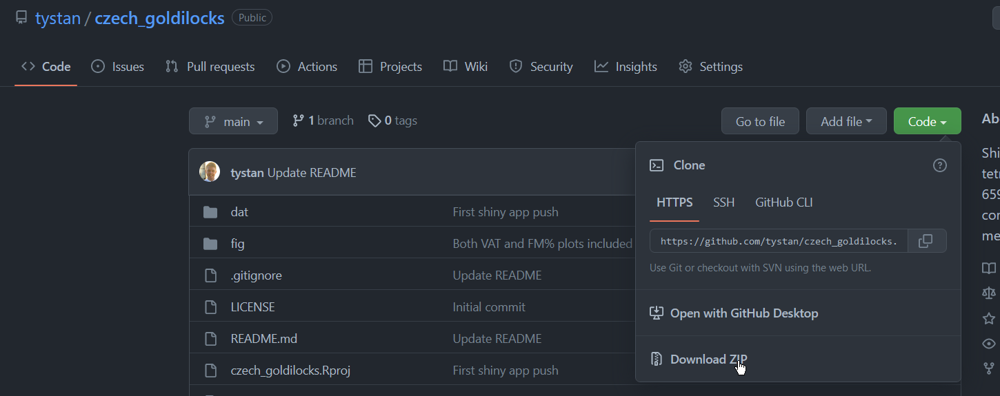

# `czech_goldilocks`

Shiny app of plotly interactive 3D tetrahedron (4-simplex) of time-use of 659 Czech children and adolescents and compositional model predicted adiposity measures.

## Reference

CL Rasmussen, A Gába, T Stanford, J Dygrýn, D Dumuid, D Janda, and K Hron.
*The Goldilocks Day for healthy adiposity measures among children and adolescents*.
Manuscript to be submitted.


## Installation


The following steps will allow you to run the `czech_goldilocks` Shiny App on your own computer:

* Make sure you have [R](https://cran.r-project.org/) and [RStudio](https://www.rstudio.com/products/rstudio/download/) installed.
* Go to the `Code` button on the top right of this page and then click `Download zip` (see below screenshot).

* Unzip the download.
* Double click the `czech_goldilocks.Rproj` file - this should open an RStudio session.
* (only has to be performed once) Make sure the prerequisite packages are installed by running the below command in the R console:
```r
install.packages(
  c(
    "shiny", "shinythemes", "readr", 
    "dplyr", "plotly", "foreach"
  )
)
```
* Now to finally run the Shiny App by running the below command in the R console:
```r
library(shiny)
runApp()
```


## Screenshots

The Shiny App is hosted [at shinyapps.io](https://tystan.shinyapps.io/czech_goldilocks/) to use.

Otherwise, below are some screenshots of the interactive plot.


