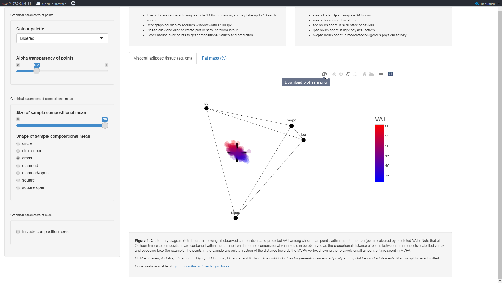
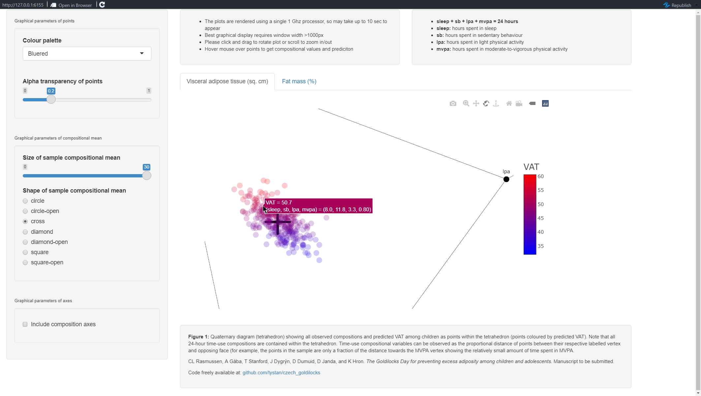

# `czech_goldilocks`

Shiny app of plotly interactive 3D tetrahedron (4-simplex) of time-use of 659 Czech children and adolescents and compositional model predicted adiposity measures.

## Reference

CL Rasmussen, A Gába, T Stanford, J Dygrýn, D Dumuid, D Janda, and K Hron.
*The Goldilocks Day for preventing excess adiposity among children and adolescents*.
Manuscript to be submitted.

## Installation

*details to come*

## Screenshots

The Shiny App is hosted [at shinyapps.io](https://tystan.shinyapps.io/czech_goldilocks/) to use.

Otherwise, below are some screenshots of the interactive plot.

